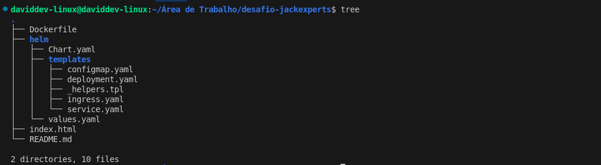
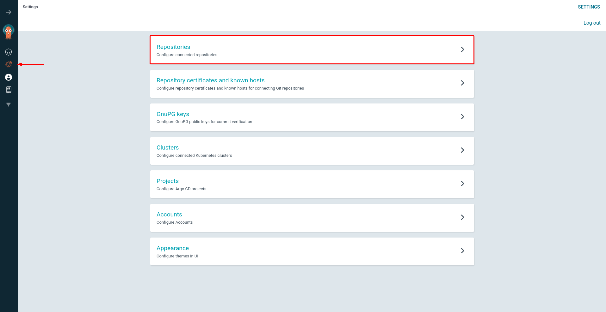
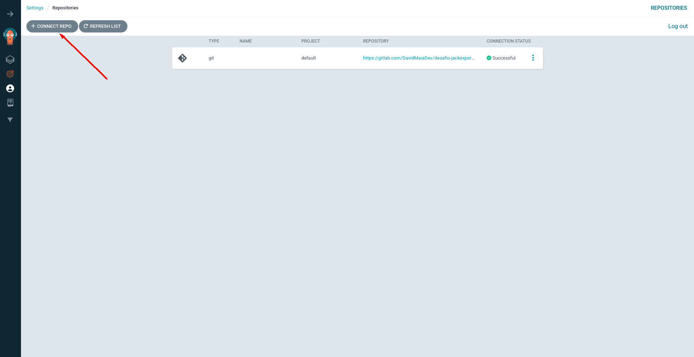
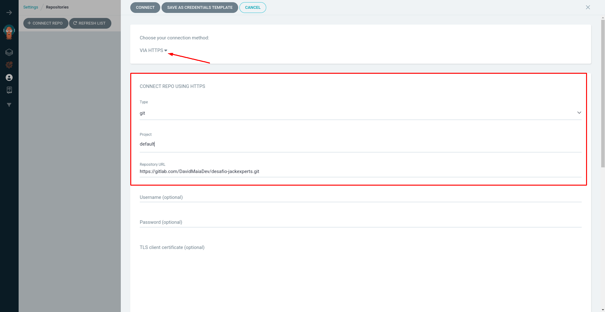
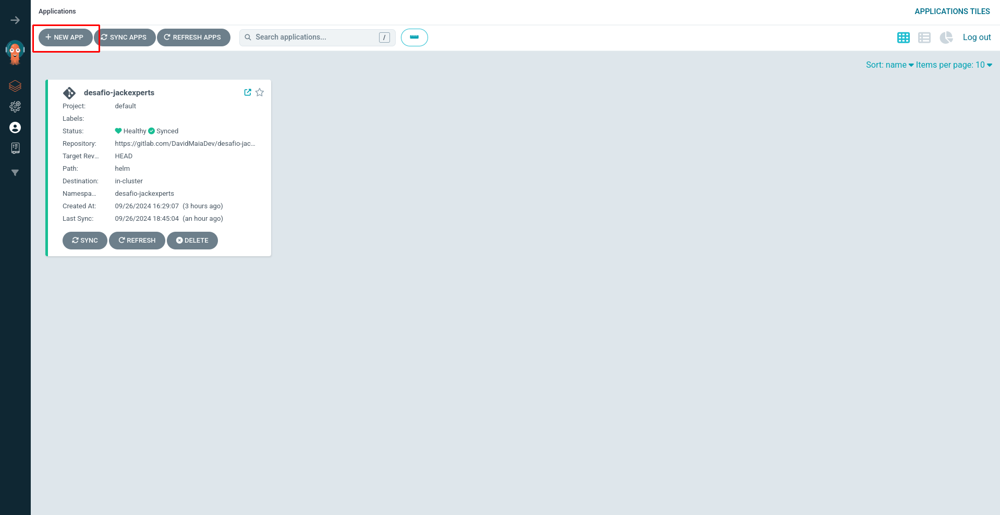
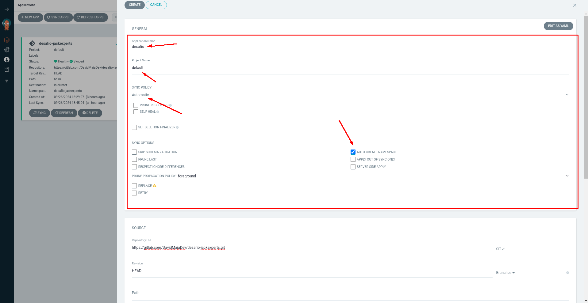
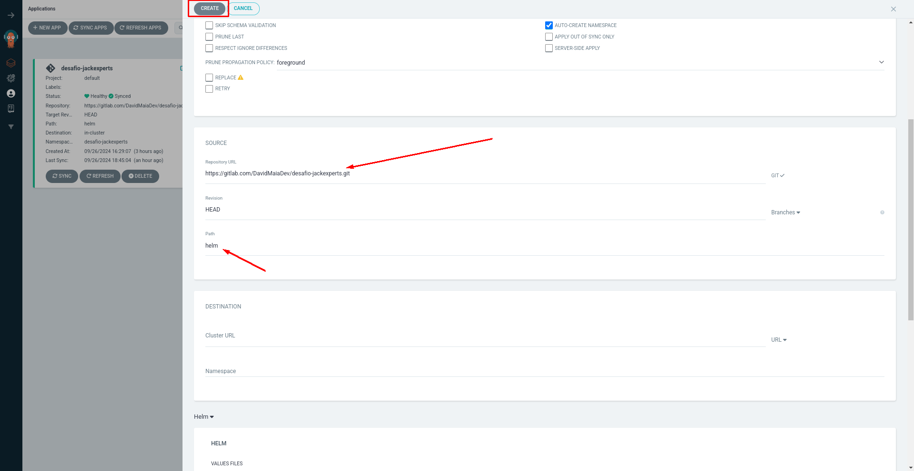

# Desafio DevOps - JackExperts 🦒🚀
Este repositório contém o projeto de desafio DevOps que envolve a criação de uma aplicação simples usando Kubernetes, Helm, e Argo CD. A aplicação consiste em uma página HTML customizável hospedada em um cluster Kubernetes, utilizando práticas modernas de DevOps, tais como: Docker, Helm, CI/CD e Kubernetes.

## Objetivo
O objetivo deste projeto é configurar e implantar uma aplicação web com as seguintes exigências:

- Repositório Git com Dockerfile e Helm.
- A imagem Docker deve ser construída e publicada no Docker Hub.
- A aplicação deve rodar como um usuário não-root.
- A página HTML deve ser configurável via ConfigMap.
- O Helm deve definir todos os objetos do Kubernetes para a aplicação.
- A aplicação deve possuir um domínio para acesso público.
- Todos os objetos no cluster devem possuir a label desafio=jackexperts.
- Documentação detalhada do processo.

## Tecnologias usadas:

- Kubernetes: Plataforma de orquestração de contêineres.
- Helm: Gerenciador de pacotes para Kubernetes.
- Argo CD: Ferramenta de CD (Continuous Delivery) para Kubernetes.
- Docker: Para criação e publicação de imagens.
- Nginx: Servidor web utilizado para hospedar a página HTML.
- K3s: Distribuição lightweight do Kubernetes.

## Veja a aplicação no ar! 😊
- Para acessar a aplicação, basta colocar no seu navegador:
  - https://desafiojackexperts.davidtechlab.site/

<span style="color:red">**Curiosidade**:</span> a aplicação está rodando no HTTPS pois estou utilizando a Cloudflare, que cria um túnel seguro e gera automaticamente um certificado SSL, garantindo que o tráfego entre o usuário e o servidor seja criptografado e protegido.

## Estrutura do Repositório




### Descrição dos Arquivos:

- **Dockerfile**: Contém as instruções para a construção da imagem Docker.
- **helm/Chart.yaml**: Arquivo de definição do Chart Helm que contém metadados sobre o chart.
- **helm/templates/**: Diretório onde estão os arquivos de template que serão utilizados para gerar os manifests do Kubernetes.
  - `configmap.yaml`: Configurações da página HTML usando ConfigMap.
  - `deployment.yaml`: Define o deployment do Nginx com as configurações do usuário não-root.
  - `_helpers.tpl`: Arquivo de templates usados para gerar strings comuns no Helm.
  - `ingress.yaml`: Configuração de Ingress para expor a aplicação ao público.
  - `service.yaml`: Define o serviço Kubernetes para expor a aplicação.
- **index.html**: Página HTML que será servida pela aplicação.
- **values.yaml**: Contém os valores padrão que são utilizados pelos templates do Helm.

---

## 1. Configuração do Projeto

### 1.1 Dockerfile

O **Dockerfile** é utilizado para construir a imagem da aplicação. Neste projeto, usamos o **Nginx** como servidor web para hospedar os arquivos HTML, garantindo que a aplicação não rode com o usuário root. Estou utilizando a imagem nginxinc/nginx-unprivileged, que é configurada para rodar o Nginx como um usuário sem privilégios de root, aumentando a segurança da aplicação.

Exemplo do **Dockerfile**:

```Dockerfile
FROM nginxinc/nginx-unprivileged

# Copia os arquivos HTML para o diretório padrão do Nginx
COPY . /usr/share/nginx/html

# Expõe a porta 8080 para servir a aplicação
EXPOSE 8080

# Comando para rodar o Nginx sem daemon
CMD ["nginx", "-g", "daemon off;"]

```

### 1.2 Publicação da Imagem no Docker Hub

A imagem Docker é construída localmente e publicada no Docker Hub. 

Ela pode ser encontrada no endereço: https://hub.docker.com/repository/docker/daviddevlinux/desafio-jackexperts 

Ou baixada via cli com o comando:
```bash
docker push daviddevlinux/desafio-jackexperts:latest
```

## 2. Instalação do K3s no Servidor/VM
Neste projeto, efoi usando o K3s, uma distribuição lightweight do Kubernetes. Siga os passos abaixo para instalar o K3s em seu servidor ou VM.

### 2.1 Passos de Instalação
Instale o K3s com o seguinte comando:

```bash
curl -sfL https://get.k3s.io | sh -
```

Desabilite o Traefik (opcional, caso prefira usar Nginx como ingress):

```bash
curl -sfL https://get.k3s.io | INSTALL_K3S_EXEC="--disable traefik" sh -
```
Verifique a instalação do K3s:
```bash
kubectl get nodes
```
Recupere o token para adicionar nós adicionais ao cluster K3s:
```bash
sudo cat /var/lib/rancher/k3s/server/node-token
```

## 2. Configuração do Kubernetes com Helm

### 2.1 Helm Chart

A aplicação é configurada usando **Helm**, o que permite gerenciar todos os objetos Kubernetes como um pacote. O Helm chart inclui definições para o **Deployment**, **Service**, **Ingress**, e **ConfigMap**.

### 2.2 Configuração via ConfigMap

O **ConfigMap** é utilizado para injetar o conteúdo HTML da página diretamente no contêiner Nginx.

### 2.3 Deploy da Aplicação

Execute os comandos abaixo para instalar o Helm chart no cluster Kubernetes:

```bash
helm install desafio-jackexperts ./helm
```

---


## 3. Gerenciamento de Deployments com Argo CD

### 3.1 Instalação do Argo CD

Instale o Argo CD no seu cluster Kubernetes:

```bash
kubectl apply -n argocd -f https://raw.githubusercontent.com/argoproj/argo-cd/stable/manifests/install.yaml
```

### 3.2 Acessando a Interface Web do Argo CD

Você pode acessar o Argo CD localmente usando **`kubectl port-forward`**:

```bash
kubectl port-forward svc/argocd-server -n argocd 8080:80
```

Acesse o Argo CD em:

```
https://localhost:8080
```
## 3.3 Obtendo as Credenciais do Argo CD

Recupere a senha inicial do Argo CD:

```bash
kubectl get secret argocd-initial-admin-secret -n argocd -o jsonpath="{.data.password}" | base64 -d
```

- **Usuário**: `admin`
- **Senha**: Obtida com o comando acima.

### 3.4 Deploy da Aplicação via Argo CD

Crie uma aplicação no Argo CD que aponte para o repositório GitLab onde está armazenado o Helm Chart passo a passo:

imagem 1:


imagem 2:


imagem 3:


imagem 4:


imagem 5:


imagem 6:



## Então...
Após você seguir os passos, você faz um teste: altere a parte do html do arquivo configmap.yaml, faça o git add, git commit -m "Aqui a mensagem que você deseja" e o git push. Após isso, só clicar para sincronizar como mostrado na imagem aqui em baixo e pronto! Deve funcionar. :)


## Conclusão

No projeto eu utilizo diversas ferramentas e tecnologias de DevOps para construir, publicar e implantar uma aplicação de forma automatizada. Utilizei Kubernetes para orquestração de contêineres, Helm para gerenciar os objetos da aplicação, e Argo CD para o gerenciamento do ciclo de vida da aplicação. Importante ressaltar que realizei o projeto para um processo seletivo de uma empresa em setembro/2024.


## Autor

David Maia - Estudante de Sistemas de Informação na UFPB, Campus IV.# desafio-jack-experts
